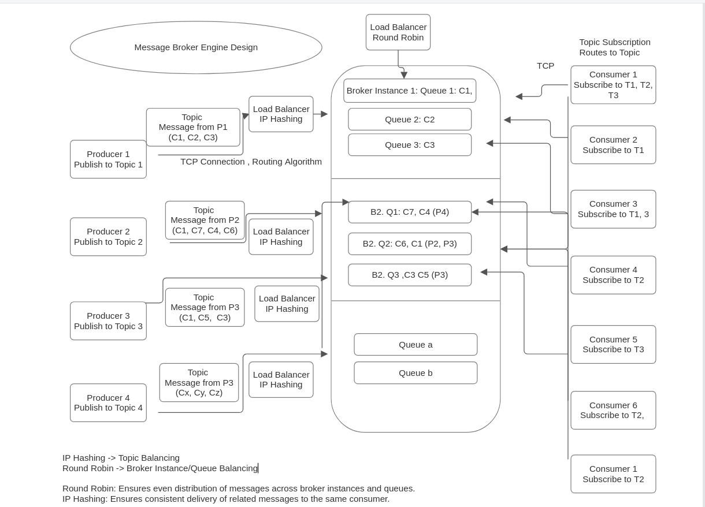

## Distributed Message Queuing Protocol for Message Broker System from Scratch

This project involves the design and implementation of a custom message broker system from scratch, based on a distributed message queuing protocol. The system aims to facilitate efficient, reliable, and scalable communication between services in a distributed environment. Key features include topic-based publish/subscribe messaging, robust message routing, durable message storage, and high availability through clustering. This project will also incorporate security measures such as authentication, authorization, and encryption, along with comprehensive monitoring and management tools to ensure optimal performance and reliability.

## Initial Design 

### Key Features

Key Features:

Message Queuing: Support for reliable message enqueueing and dequeueing.

Topic-Based Pub/Sub: Enable publish/subscribe messaging using topics for flexible communication patterns.

Routing: Intelligent message routing to appropriate queues or topics.

Durable Storage: Options for persistent message storage to ensure message reliability.

Scalability: Clustering and load balancing for handling high traffic and ensuring fault tolerance.

Security: Implement authentication, authorization, and encryption to secure message exchanges.

### Outcome

Deep understanding of distributed systems, networking, and messaging protocols along with load balancing, Authentication, Authorization, Encryption.